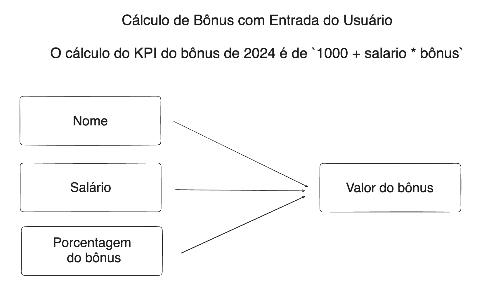

# CRIAÇÃO DE KPI SIMPLES

Nesse primeiro projeto, fiz um KPI simples para cálculo *automático* de Bônus do Funcionário. 

Seu Funcionamento é simples, porém **intuitivo e preciso**.

O Programa irá solicitar:

1. *O Nome do Usuário*
2. *O Seu Salário*
3. *Qual o valor da sua comissão*

Após estes inputs, o programa irá calcular o bônus **automaticamente**, tendo em vista que implicito no código, há um valor de comissão fixo, que é somado ao bônus variável.